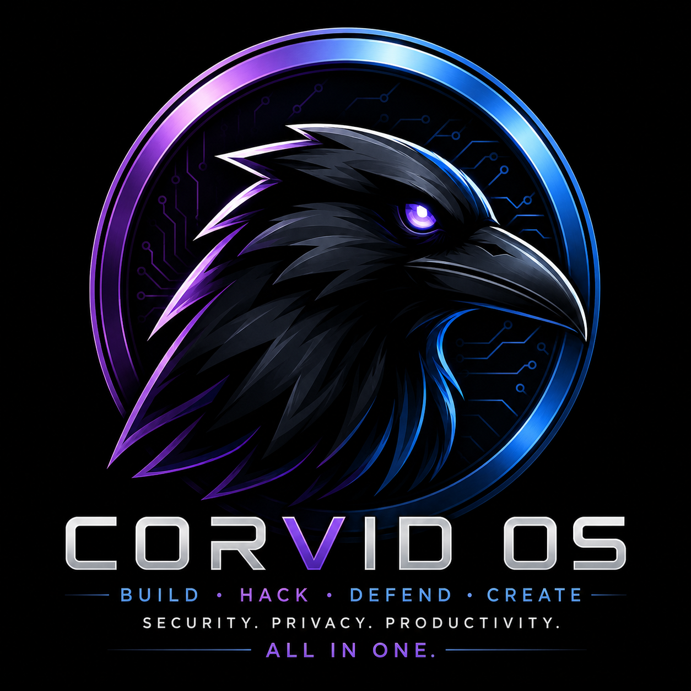
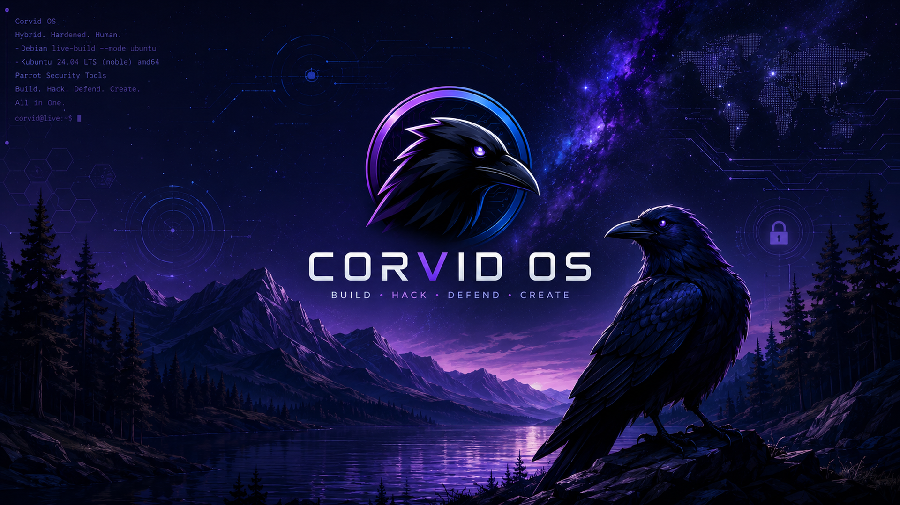

<p align="center">
  
</p>

<h1 align="center">Corvid OS</h1>

<p align="center">
  <strong>Build &middot; Hack &middot; Defend &middot; Create</strong><br>
  <em>Security. Coding. AI agents. One stable image.</em>
</p>

<p align="center">
  
  
  
  
  
  
</p>

Corvid OS is a security-minded, coding-first, AI-agent-ready daily driver. Ubuntu LTS
underneath for stability, KDE Plasma on top, a curated security toolset drawn from
Ubuntu's own repositories, a full development stack, and built-in tooling that installs
AI coding agents and local LLM runtimes in one step. Built entirely with Debian
`live-build`, and the whole build lives in this repository so the image is fully
reproducible from source.

> **Status:** the full amd64 ISO is built and boot-verified in a UEFI virtual
> machine. It reaches the KDE Plasma desktop with the Corvid wallpaper, the curated
> security toolset, the `corvid-ai-setup` AI-agent installer, and the branded
> Calamares installer all present. The first public release is being published; the
> **arm64 / Raspberry Pi 5** variant is on the roadmap. The build specification is
> [`SPEC.md`](SPEC.md).

---

## Why Corvid exists

Most people who do security work end up choosing between two compromises:

- **Run a pentest distro as a daily driver** (Kali, Parrot). Great tools, but
  rolling-release churn and a security-first base that is not built to be a
  comfortable, stable development machine.
- **Run a stable base and bolt tools on by hand.** Comfortable and predictable, but
  you rebuild the same toolchain on every machine and there is no coherent security
  posture out of the box.

Corvid takes a third path. It starts from **Kubuntu 24.04 LTS**, a base that is
stable, familiar, and supported for years, then adds a **curated security toolset
drawn from Ubuntu's own repositories**, with **Kali configured as a pinned fallback**
for the handful of tools Ubuntu does not carry. The tools are present without the base
ever drifting. The result is one image that is a serious workstation and a full
security lab at the same time, with a hardened posture applied by default rather than
assembled by hand.

It is aimed at advanced and security-minded coders: people who want a curated pentest
toolset, a complete development stack, built-in AI agent tooling, disk encryption, and
kernel hardening on day one, on a base they can trust to stay put.

## Features

- **KDE Plasma desktop.** Polished, fast, and highly configurable. Corvid starts from
  Kubuntu so Plasma is correct from the first boot rather than retrofitted.
- **A curated security toolset.** Recon, web, network, forensics, and exploitation
  tools installed from Ubuntu's own repositories (nmap, sqlmap, hydra, john,
  aircrack-ng, wireshark, hashcat, gobuster, nikto, binwalk, and more), with **Kali
  configured as a pinned fallback** for the tools Ubuntu does not package. Everything
  is pinned against the fixed LTS base so tool updates never drag the core system with
  them.
- **Built-in AI agent installer.** A `corvid-ai-setup` menu offers to install AI
  coding agents and local LLM runtimes in one step, so you never have to hunt for the
  install commands: Claude Code, OpenAI Codex CLI, Google Gemini CLI, Aider, Ollama,
  LM Studio, and Hermes (Nous Research). Run `corvid-ai-setup` from a terminal or
  launch it from the Plasma menu.
- **AnonSurf and Tor.** Grafted onto the Ubuntu base with its systemd unit and
  firewall rules wired up explicitly, for system-wide anonymized routing on demand.
- **LUKS full-disk encryption by default.** The Calamares installer defaults to LUKS
  FDE, and the live USB supports encrypted persistence.
- **Hardened kernel and AppArmor.** A tuned `sysctl` hardening profile plus AppArmor
  in enforce mode, applied at build time and calibrated so security tooling still works.
- **A complete development stack.** Python, Go, Rust, Node, Ruby, and C/C++
  toolchains, VS Code and Neovim, Docker and distrobox, ready to work.
- **CZD-Tools baked in.** A menu-driven launcher for a curated OSINT and pentest
  suite, reachable as `czd` on the command line or from the Plasma menu.

## Desktop

<p align="center">
  
</p>

## Architecture at a glance

Corvid is assembled by Debian `live-build`. The pipeline is:

1. **Bootstrap** a Kubuntu 24.04 (noble) base into a chroot.
2. **Add a pinned Kali fallback repo.** Ubuntu/noble is pinned high (authoritative);
   Kali is pinned low so only the explicitly named security packages Ubuntu lacks are
   pulled from it, never core libraries. This one rule is what keeps the LTS base
   intact.
3. **Install package lists.** Split by concern: base, desktop (KDE), devstack, and
   security (curated from Ubuntu, with a few named Kali fallbacks).
4. **Run build hooks** to configure the system. Hooks are numbered to fix their load
   order: hardening and AnonSurf, dev-stack configuration, the AI-agent installer and
   CZD-Tools, then branding.
5. **Add the installer.** Calamares, configured for LUKS full-disk encryption by
   default and rebranded for KDE.
6. **Emit a bootable ISO,** UEFI-bootable via the grub-efi + xorriso remaster.

The build runs on any Ubuntu 24.04 Linux host, never on a developer laptop, so results
are clean and repeatable. Full detail is in [`docs/ARCHITECTURE.md`](docs/ARCHITECTURE.md).

## Download

Published images and checksums:

- **GitHub Releases:** [github.com/CamoRageaholic1/corvid-os/releases](https://github.com/CamoRageaholic1/corvid-os/releases)
- **Download (Google Drive):** [`corvid-amd64.iso`](https://drive.google.com/file/d/1R9s2XHJ6cuEqSAGcUAoJRutk2FkR7C6k/view) (amd64, 5.39 GB, UEFI)

Corvid images are **UEFI-bootable**: copy the `.iso` onto a Ventoy stick (no
flashing needed) or write it to a USB drive, and boot the target in UEFI mode.
Verify the download with `shasum -a 256 corvid-amd64.iso`. It should print
`7970c43277634016354e06d9a4de1fe08b26b824e645996d73783778b4ed8beb`.

## Build quickstart

Build on **any Ubuntu 24.04 Linux host** (VM, container, cloud instance, or bare
metal) with `live-build` installed. This repo is config only - nothing builds on a
non-Linux workstation. Full step-by-step (deps, UEFI QEMU test, troubleshooting) is
in [`docs/BUILD.md`](docs/BUILD.md).

```sh
# From the repo root on the Linux build host:
sudo lb config    # materialize the build tree from auto/config
sudo lb build     # build + auto-remaster -> bootable corvid-amd64.iso
```

`lb build` (via `auto/build`) stages branding, builds with live-build, and
remasters the result into a UEFI-bootable `corvid-amd64.iso`. Homelab users can
optionally stand up a builder with `provisioning/proxmox-build-vm.sh`, but it is
just one convenience, not a requirement.

## Roadmap

Planned work, including the **arm64 / Raspberry Pi 5** variant (which sources its
fallback tools from Kali's arm64 repo) and the deferred **Secure Boot / MOK**
enrollment path, is tracked in [`docs/ROADMAP.md`](docs/ROADMAP.md). The ARM variant's
design and config stubs already live under [`arm64/`](arm64/).

## A note on intent

Corvid bundles offensive security tooling. It is built for authorized security
research, penetration testing, and learning on systems you own or have explicit
permission to test. Use it lawfully and responsibly.

## License

The Corvid OS build configuration in this repository is released under the MIT License
(see [`LICENSE`](LICENSE)). The software it assembles (Ubuntu, KDE Plasma, the curated
security tools, and other components) remains under its own respective upstream
licenses.

---

<p align="center">
  Maintained by <strong>David Osisek</strong> (CamoZeroDay)
</p>
